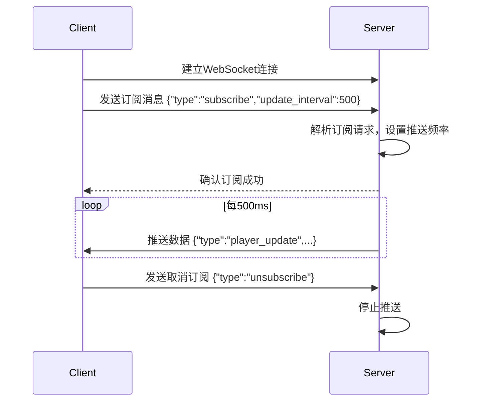

# MaicraftAgent API 接口文档

## 全局响应格式

### 成功响应

```json
{
  "isSuccess": true,
  "message": "操作成功",
  "data": {
    // 具体数据内容
  },
  "timestamp": 1704067200000,
  "request_id": "req_001"
}
```

### 错误响应

```json
{
  "isSuccess": false,
  "message": "错误描述",
  "data": {
    "details": "详细错误信息"
  },
  "timestamp": 1704067200000,
  "request_id": "req_001"
}
```

## 1. 日志管理

**注意:** 当前系统使用 loguru 库进行日志记录，仅提供实时控制台输出，不支持历史日志存储和查询。

### 1.1 REST API 接口

#### 获取当前日志配置

````
GET /api/logs/config
````

**响应示例:**

```json
{
  "isSuccess": true,
  "message": "success",
  "data": {
    "level": "INFO"
  }
}
```

#### 获取日志级别

````
GET /api/logs/level
````

**响应示例:**

```json
{
  "isSuccess": true,
  "message": "success",
  "data": {
    "current_level": "INFO",
    "available_levels": ["TRACE", "DEBUG", "INFO", "SUCCESS", "WARNING", "ERROR", "CRITICAL"]
  }
}
```

#### 更新日志级别

````
POST /api/logs/level
````

**请求体:**

```json
{
  "level": "DEBUG"
}
```

**响应:**

```json
{
  "isSuccess": true,
  "message": "success",
  "data": {
    "message": "日志级别已更新为 DEBUG"
  }
}
```

### 1.2 WebSocket 实时日志

#### 连接地址

````
ws://localhost:8000/ws/logs
````

#### 消息格式

**客户端发送:**

```json
{
  "type": "subscribe",
  "levels": ["INFO", "WARNING", "ERROR"],
  "modules": ["MCPClient", "MaiAgent"]
}
```

**服务端推送:**

```json
{
  "type": "log",
  "timestamp": 1704067200000,
  "level": "INFO",
  "module": "MCPClient",
  "message": "MCP 客户端已连接"
}
```

## 2. 配置管理

基于 `config.py` 的 MaicraftConfig 类和 `config.toml` 文件，实现完整的配置管理功能。

### 2.1 获取完整配置

````
GET /api/config
````

**响应示例:**

```json
{
  "isSuccess": true,
  "message": "获取配置成功",
  "data": {
    "inner": {
      "version": "0.4.0"
    },
    "api": {
      "host": "0.0.0.0",
      "port": 20914,
      "enable_cors": true,
      "log_level": "warning"
    },
    "bot": {
      "player_name": "EvilMai",
      "bot_name": "麦麦"
    },
    "game": {
      "goal": "以合适的步骤，建立营地，挖到16个钻石，并存储"
    },
    "llm": {
      "model": "qwen3-next-80b-a3b-instruct",
      "temperature": 0.2,
      "max_tokens": 1024,
      "api_key": "***masked***",
      "base_url": "https://dashscope.aliyuncs.com/compatible-mode/v1"
    },
    "llm_fast": {
      "model": "gpt-4o-mini",
      "temperature": 0.2,
      "max_tokens": 1024
    },
    "visual": {
      "enable": false
    },
    "vlm": {
      "model": "Pro/THUDM/GLM-4.1V-9B-Thinking",
      "temperature": 0.3,
      "max_tokens": 1024,
      "api_key": "***masked***"
    },
    "logging": {
      "level": "INFO",
      "enable_json": false,
      "log_to_file": true,
      "log_dir": "logs",
      "rotation": "1 day",
      "retention": "7 days"
    }
  },
  "timestamp": 1704067200000
}
```

### 2.2 获取配置模式定义

````
GET /api/config/schema
````

### 2.3 更新配置

````
PUT /api/config
````

### 2.4 重置配置

````
POST /api/config/reset
````

### 2.5 验证配置

````
POST /api/config/validate
````

### 2.6 导入配置

````
POST /api/config/import
````

### 2.7 导出配置

````
GET /api/config/export?sections=llm,logging&format=toml
````

## 3. 任务管理

基于 `agent/to_do_list.py` 的 ToDoList 类实现，提供完整的任务生命周期管理。

### 3.1 获取任务列表

````
GET /api/tasks
````

**响应示例:**

```json
{
  "isSuccess": true,
  "message": "获取任务列表成功",
  "data": {
    "tasks": [
      {
        "id": "1",
        "details": "建立营地，建造基础庇护所和工作台",
        "done_criteria": "完成基础庇护所建造，工作台可用",
        "progress": "已建造工作台，正在收集木材",
        "done": false
      },
      {
        "id": "2",
        "details": "收集基础资源：木材和石头",
        "done_criteria": "物品栏中有足够的木材和石头",
        "progress": "已完成",
        "done": true
      }
    ],
    "total": 5,
    "completed": 2,
    "in_progress": 2,
    "pending": 1,
    "is_all_done": false
  },
  "timestamp": 1704067200000
}
```

### 3.2 获取单个任务

````
GET /api/tasks/{task_id}
````

### 3.3 创建任务

````
POST /api/tasks
````

### 3.4 更新任务进度

````
PUT /api/tasks/{task_id}/progress
````

### 3.5 标记任务完成

````
PUT /api/tasks/{task_id}/complete
````

### 3.6 删除任务

````
DELETE /api/tasks/{task_id}
````

### 3.7 清空所有任务

````
DELETE /api/tasks
````

### 3.8 批量操作

````
POST /api/tasks/batch
````

## 4. AI 动作执行

基于 `agent/mai_agent.py` 的 MaiAgent 类实现，支持各种Minecraft游戏动作执行。

### 4.1 获取可用动作列表

````
GET /api/actions
````

**响应示例:**

```json
{
  "isSuccess": true,
  "message": "获取可用动作列表成功",
  "data": {
    "actions": [
      {
        "action_type": "move",
        "name": "移动",
        "description": "移动到指定位置",
        "parameters": {
          "position": {
            "type": "object",
            "properties": {
              "x": {"type": "number", "description": "目标X坐标"},
              "y": {"type": "number", "description": "目标Y坐标"},
              "z": {"type": "number", "description": "目标Z坐标"}
            },
            "required": ["x", "y", "z"]
          }
        },
        "category": "movement",
        "enabled": true
      },
      {
        "action_type": "mine_block",
        "name": "挖掘方块",
        "description": "挖掘指定类型的方块",
        "parameters": {
          "name": {"type": "string", "description": "方块名称，如 'stone', 'iron_ore'"},
          "count": {"type": "integer", "description": "挖掘数量", "default": 1},
          "digOnly": {"type": "boolean", "description": "是否只挖掘不收集", "default": false}
        },
        "category": "mining",
        "enabled": true
      }
    ],
    "categories": {
      "movement": ["move"],
      "mining": ["mine_block", "mine_block_by_position", "mine_in_direction"],
      "crafting": ["craft"],
      "interaction": ["use_furnace", "use_chest"],
      "combat": ["kill_mob"],
      "inventory": ["toss_item", "eat", "use_item"]
    },
    "total": 18
  }
}
```

### 4.2 执行单个动作

````
POST /api/actions/execute
````

**支持的动作类型:**

- `move`: 移动到指定位置
- `mine_block`: 挖掘附近方块
- `craft`: 合成物品
- `use_furnace`: 使用熔炉
- `use_chest`: 使用箱子
- `eat`: 吃食物
- `kill_mob`: 杀死怪物

### 4.3 批量执行动作

````
POST /api/actions/batch
````

### 4.4 获取动作执行历史

````
GET /api/actions/history?limit=20&action_type=move&status=success
````

### 4.5 停止当前动作

````
POST /api/actions/stop
````

## 5. 游戏状态

基于环境信息、位置管理、容器缓存和方块缓存系统，实现完整的Minecraft游戏状态监控和管理。

### 5.1 WebSocket 实时游戏状态

系统提供三个专用WebSocket端点，根据数据类型和更新频率分离：

#### 玩家数据端点 (Player)
````
ws://localhost:20914/ws/game/player
````

**订阅消息:**
```json
{
  "type": "subscribe",
  "update_interval": 500  // 高频更新
}
```

**推送数据:**
```json
{
  "type": "player_update",
  "timestamp": 1704067200000,
  "data": {
    "name": "EvilMai",
    "health": 20,
    "max_health": 20,
    "food": 18,
    "max_food": 20,
    "experience": 1250,
    "level": 15,
    "position": {
      "x": 123.5,
      "y": 64.0,
      "z": -456.8,
      "yaw": 45.2,
      "pitch": -12.3,
      "on_ground": true
    },
    "gamemode": "survival",
    "equipment": {
      "main_hand": {"name": "diamond_pickaxe", "count": 1, "damage": 5},
      "helmet": {"name": "iron_helmet", "count": 1, "damage": 25},
      "chestplate": null,
      "leggings": null,
      "boots": null
    },
    "inventory": {
      "occupied_slots": 15,
      "total_slots": 36,
      "empty_slots": 21,
      "items": [
        {
          "slot": 0,
          "name": "diamond_pickaxe",
          "display_name": "钻石镐",
          "count": 1,
          "max_stack": 1,
          "damage": 5,
          "max_damage": 1561
        }
      ]
    }
  }
}
```

#### 世界数据端点 (World)
````
ws://localhost:20914/ws/game/world
````

**订阅消息:**
```json
{
  "type": "subscribe",
  "update_interval": 2000  // 中频更新
}
```

**推送数据:**
```json
{
  "type": "world_update",
  "timestamp": 1704067200000,
  "data": {
    "time": {
      "time_of_day": 18000,
      "formatted_time": "夜晚 (18:00)",
      "day_count": 125
    },
    "weather": {
      "weather": "rain",
      "formatted_weather": "下雨",
      "duration": 1200
    },
    "location": {
      "dimension": "overworld",
      "biome": "plains",
      "light_level": 8
    },
    "nearby_blocks": [
      {
        "name": "grass_block",
        "position": {"x": 124, "y": 63, "z": -457},
        "distance": 2.1
      }
    ],
    "nearby_entities": [
      {
        "name": "cow",
        "display_name": "牛",
        "type": "animal",
        "distance": 12.5,
        "position": {"x": 130.5, "y": 64.0, "z": -450.2},
        "health": 10,
        "max_health": 10
      }
    ]
  }
}
```

#### 标记点数据端点 (Marker)
````
ws://localhost:20914/ws/game/marker
````

**订阅消息:**
```json
{
  "type": "subscribe",
  "update_interval": 0  // 仅在变动时推送
}
```

**推送数据:**
```json
{
  "type": "marker_update",
  "timestamp": 1704067200000,
  "action": "add",  // add, update, remove
  "data": {
    "name": "home_base",
    "info": "主基地，包含工作台和箱子",
    "position": {"x": 100.5, "y": 64.0, "z": 200.3},
    "type": "base",
    "created_time": 1704067200000,
    "visit_count": 25
  }
}
```

### 5.2 获取游戏快照

````
GET /api/environment/snapshot
````

### 5.3 获取玩家信息

````
GET /api/environment/player
````

### 5.4 获取物品栏信息

````
GET /api/environment/inventory
````

### 5.5 获取世界信息

````
GET /api/environment/world
````

### 5.6 获取附近实体

````
GET /api/environment/nearby/entities?range=16
````

### 5.7 位置管理

#### 获取所有位置点

````
GET /api/locations
````

#### 添加位置点

````
POST /api/locations
````

#### 更新位置点

````
PUT /api/locations/{name}
````

#### 删除位置点

````
DELETE /api/locations/{name}
````

#### 获取位置统计

````
GET /api/locations/stats
````

### 5.8 容器管理

#### 获取容器列表

````
GET /api/containers?type=all&range=32
````

#### 验证容器存在

````
GET /api/containers/verify/{x}/{y}/{z}
````

#### 清理无效容器

````
DELETE /api/containers/invalid
````

### 5.9 方块缓存管理

#### 获取方块缓存统计

````
GET /api/blocks/stats
````

#### 获取指定区域方块

````
GET /api/blocks/region?x=100&z=200&radius=16
````

#### 搜索特定方块

````
GET /api/blocks/search?name=diamond_ore&limit=10
````

## 6. WebSocket 通用规范

### 6.1 连接管理

**连接建立示例:**

```javascript
// 玩家数据连接
const playerWs = new WebSocket('ws://localhost:20914/ws/game/player')

playerWs.onopen = () => {
  console.log('Player WebSocket connected')
  // 发送订阅消息
  playerWs.send(JSON.stringify({
    "type": "subscribe",
    "update_interval": 500
  }))
}

playerWs.onmessage = (event) => {
  const data = JSON.parse(event.data)
  handlePlayerUpdate(data)
}

playerWs.onclose = () => {
  console.log('Player WebSocket disconnected')
}

// 世界数据连接
const worldWs = new WebSocket('ws://localhost:20914/ws/game/world')

worldWs.onopen = () => {
  console.log('World WebSocket connected')
  worldWs.send(JSON.stringify({
    "type": "subscribe",
    "update_interval": 2000
  }))
}

worldWs.onmessage = (event) => {
  const data = JSON.parse(event.data)
  handleWorldUpdate(data)
}

// 标记点数据连接
const markerWs = new WebSocket('ws://localhost:20914/ws/game/marker')

markerWs.onopen = () => {
  console.log('Marker WebSocket connected')
  markerWs.send(JSON.stringify({
    "type": "subscribe",
    "update_interval": 0
  }))
}

markerWs.onmessage = (event) => {
  const data = JSON.parse(event.data)
  handleMarkerUpdate(data)
}
```

### 6.2 订阅机制

**实现职责分工:**

**服务端实现 (MaicraftAgent):**
- WebSocket端点处理 (`/ws/game/player`, `/ws/game/world`, `/ws/game/marker`)
- 订阅消息解析和处理
- 数据推送频率控制
- 定时或事件驱动的数据推送逻辑

**客户端实现 (前端项目):**
- 建立WebSocket连接
- 发送订阅/取消订阅消息
- 接收和处理推送的数据

**订阅机制说明:**
WebSocket协议本身只提供双向通信能力，订阅机制是我们基于WebSocket构建的**应用层协议**，用于管理数据流的开关和频率控制。




**客户端发送订阅消息:**

```json
{
  "type": "subscribe",
  "update_interval": 500  // 更新间隔(ms), 0表示仅在变动时推送
}
```

**客户端发送取消订阅消息:**

```json
{
  "type": "unsubscribe"
}
```

**心跳机制:**

```json
// 客户端发送
{
  "type": "ping",
  "timestamp": 1704067200000
}

// 服务端回复
{
  "type": "pong",
  "timestamp": 1704067200000
}
```

## 7. 错误处理规范

### 7.1 HTTP 错误响应

```json
{
  "isSuccess": false,
  "message": "VALIDATION_ERROR: 输入参数无效",
  "data": {
    "details": {
      "field": "temperature",
      "reason": "必须在 0.0-2.0 之间"
    }
  },
  "timestamp": 1704067200000,
  "request_id": "req_001"
}
```

### 7.2 WebSocket 错误消息

```json
{
  "type": "error",
  "errorCode": "CONNECTION_FAILED",
  "message": "无法连接到游戏状态服务器",
  "endpoint": "ws://localhost:20914/ws/game/player",
  "timestamp": 1704067200000
}
```

**常见错误码:**
- `CONNECTION_FAILED`: WebSocket连接失败
- `SUBSCRIPTION_FAILED`: 订阅失败
- `INVALID_INTERVAL`: 无效的更新间隔
- `ENDPOINT_NOT_FOUND`: 端点不存在

### 7.3 错误代码定义

| 错误代码              | 说明             |
| --------------------- | ---------------- |
| `VALIDATION_ERROR`    | 输入参数验证失败 |
| `RESOURCE_NOT_FOUND`  | 请求的资源不存在 |
| `PERMISSION_DENIED`   | 权限不足         |
| `RATE_LIMIT_EXCEEDED` | 请求频率超限     |
| `INTERNAL_ERROR`      | 服务器内部错误   |
| `CONNECTION_FAILED`   | 连接失败         |
| `TIMEOUT_ERROR`       | 请求超时         |
